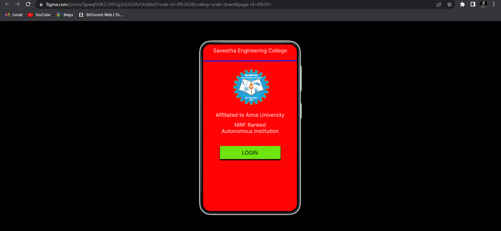
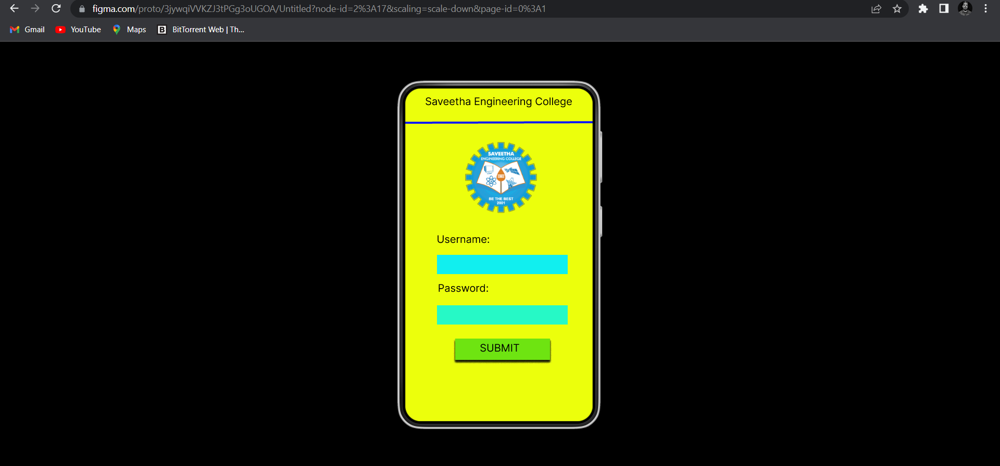
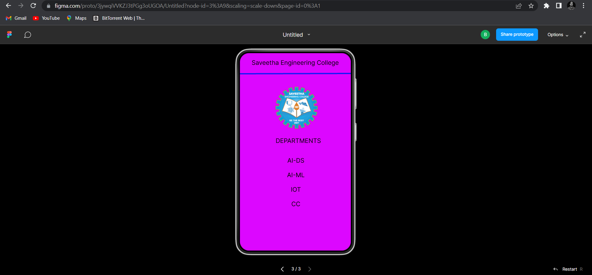

## AIM:

To design, develop and deploy a web application for event registration.

## DESIGN STEPS:

### Step 1:

Create a new frame.

### Step 2:

Select any one present size of your choice.

### Step 3:

Select the shapes you need.

### Step 4:

Import images as needed.

### Step 5: 

Create pages based on your need and link them.

### Step 6:

Validate the HTML and CSS code.

### Step 7:

Publish the website in the given URL.

## DESIGN:

Figma.

## code:


/* Home Page */
```css

position: relative;
width: 360px;
height: 640px;
background: #F01313;

/* LOGIN */

position: absolute;
width: 138px;
height: 19px;
left: 98px;
top: 411px;
font-family: 'Inter';
font-style: normal;
font-weight: 400;
font-size: 22px;
line-height: 27px;
text-align: center;
color: #190202;
text-shadow: 0px 4px 4px rgba(0, 0, 0, 0.25);
/* Rectangle 1 */
position: absolute;
width: 179px;
height: 50px;
left: 78px;
top: 396px;
background: #10F651;

/* logo 1 */

position: absolute;
width: 112px;
height: 102px;
left: 116px;
top: 94px;
background: url(logo.png);

/* Line 1 */

position: absolute;
width: 365px;
height: 0px;
left: 0px;
top: 70px;
border: 5px solid #4509EE;
box-shadow: 0px 4px 4px rgba(0, 0, 0, 0.25);
transform: rotate(0.16deg);

/* Affiliated To Anna University NIRF Ranked Autonomous Institution */

position: absolute;
width: 332px;
height: 41px;
left: 17px;
top: 225px;
font-family: 'Inter';
font-style: normal;
font-weight: 400;
font-size: 22px;
line-height: 27px;
text-align: center;
color: #FFFFFF;

/* Saveetha Engineering College */

position: absolute;
width: 332px;
height: 41px;
left: 17px;
top: 17px;
font-family: 'Inter';
font-style: normal;
font-weight: 400;
font-size: 22px;
line-height: 27px;
text-align: center;
color: #FFFFFF;

/* Login Page */

position: relative;
width: 360px;
height: 640px;
background: #DEFE19;

/* Departments */

position: absolute;
width: 277px;
height: 33px;
left: 31px;
top: 247px;
font-family: 'Inter';
font-style: normal;
font-weight: 400;
font-size: 22px;
line-height: 27px;
text-align: center;
color: #FFFFFF;

/* AI-DS */

position: absolute;
width: 141px;
height: 26px;
left: 93px;
top: 320px;
font-family: 'Inter';
font-style: normal;
font-weight: 400;
font-size: 22px;
line-height: 27px;
text-align: center;
color: #FFFFFF;

/* AI-ML */

position: absolute;
width: 121px;
height: 18px;
left: 93px;
top: 367px;
font-family: 'Inter';
font-style: normal;
font-weight: 400;
font-size: 22px;
line-height: 27px;
text-align: center;
color: #FFFFFF;

/* IOT */

position: absolute;
width: 112px;
height: 32px;
left: 98px;
top: 468px;
font-family: 'Inter';
font-style: normal;
font-weight: 400;
font-size: 22px;
line-height: 27px;
text-align: center;
color: #FFFFFF;


/* CSE */

position: absolute;
width: 75px;
height: 34px;
left: 119px;
top: 413px;
font-family: 'Inter';
font-style: normal;
font-weight: 400;
font-size: 22px;
line-height: 27px;
text-align: center;
color: #FFFFFF;

/* IT */

position: absolute;
width: 55px;
height: 27px;
left: 127px;
top: 581px;
font-family: 'Inter';
font-style: normal;
font-weight: 400;
font-size: 22px;
line-height: 27px;
/* identical to box height */
text-align: center;
color: #FFFFFF;
```


## OUTPUT:





## Result:

Thus the program to design, develop and deploy a web application for event registration is completed successfully.